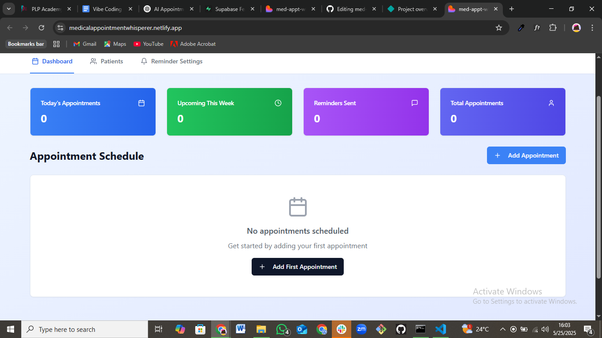
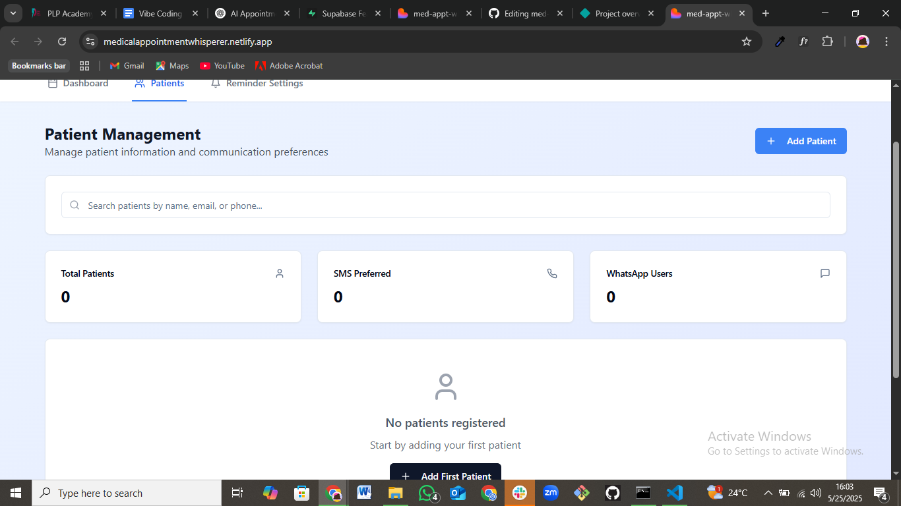
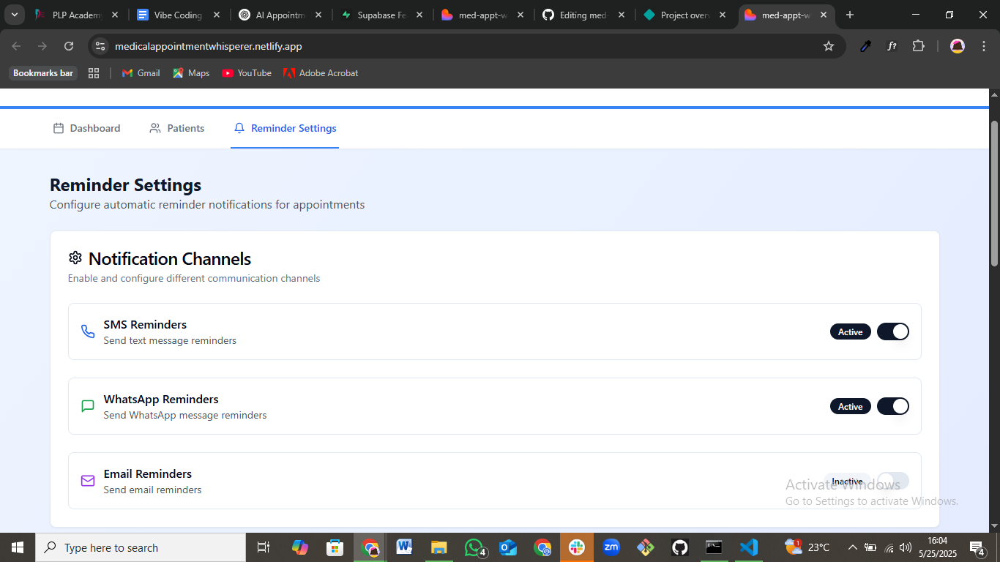

## 🩺 AI-Powered Medical Appointment Reminder Tool

An intelligent appointment tracking and reminder system designed to help clinics and private doctors keep patients on schedule for follow-ups. Built using AI-assisted tools like **lovable.dev** and **Supabase AI**, this project integrates smart technology with user-friendly design to automate reminders via SMS, WhatsApp, and email.

---

## Project info
- **[project hosted on Netlify](https://medicalappointmentwhisperer.netlify.app/)**
- Project details **URL**: https://lovable.dev/projects/8b1b2d06-2448-4b75-a149-4f89b6c5e25c

## 📸 Screenshots

### 📅 Appointment Dashboard


### Patient Preview


### 🔔 Reminder Preview


### Medical Appointment Schema 
.png)

---
  ## 🚀 Features

- 🗓️ Create and manage patient appointments
- 🔔 Automated reminders to patients and doctors
- 💬 Twilio integration for SMS and WhatsApp messaging
- 📧 Optional email reminder support
- 🤖 AI-powered message personalization (OpenAI)
- 📋 Optional: Smart follow-up recommendations

  ## 🛠️ Tech Stack

### 🧠 AI & Backend Services
| Tool         | Purpose                                         |
|--------------|-------------------------------------------------|
| **Supabase AI**   | Data management, real-time syncing, and auth  |
| **OpenAI**        | Message personalization & NLP               |
| **Twilio API**    | SMS & WhatsApp message delivery             |

### 🎨 Frontend Stack (via lovable.dev)
| Tool           | Role                                   |
|----------------|----------------------------------------|
| **Vite**       | Frontend build tool (fast dev server)  |
| **TypeScript** | Type-safe development                  |
| **React**      | UI library for building interfaces     |
| **shadcn/ui**  | Modern UI components                   |
| **Tailwind CSS** | Utility-first styling framework       |

---

## To view project...
```
# Step 1: Clone the repository using the project's Git URL.
git clone <https://github.com/fiona12-code/med-appt-whisperer-bot.git>

# Step 2: Navigate to the project directory.
cd <'med-appt-whisperer-bot>

# Step 3: Install the necessary dependencies.
npm install

# Step 4: Start the development server with auto-reloading and an instant preview.
Create a .env file and add:
VITE_SUPABASE_URL=your-supabase-url
VITE_SUPABASE_ANON_KEY=your-supabase-anon-key
OPENAI_API_KEY=your-openai-key
TWILIO_ACCOUNT_SID=your-twilio-sid
TWILIO_AUTH_TOKEN=your-twilio-token
TWILIO_PHONE_NUMBER=+123456789

#Run the development server
npm run dev

```

## 📲 API / Frontend Modules
**Module / Feature**        	**Description**
- Appointments CRUD          	 Add, view, edit, and delete appointments
- Reminders Engine	           Schedules reminders before appointments
- Patient Notifications	       Sends messages via Twilio API
- AI Messaging	               Personalizes messages using OpenAI
- UI Components	               Built using shadcn/ui & Tailwind CSS

# 🤖 AI Features
- ✨ Message Personalization – OpenAI customizes reminder tone and content

- ⏱️ Smart Scheduling – (Planned) Predict optimal follow-up times

- 🧠 Patient Response Understanding – (Planned) Detects reschedule/cancel intents via AI

# 🔐 Security Notes
- Keep .env files out of version control

- Use HTTPS in production

- Secure all API keys and sanitize input data

# 📌 Future Improvements
- 📅 Google Calendar / Outlook integration

- 📲 Two-way WhatsApp messaging with AI reply parsing

- 🌐 Multilingual support

- 📊 Dashboard analytics for doctors


## Technologies used in this project

This project is built with:
- Lovable.ai
- Vite
- TypeScript
- React
- shadcn-ui
- Tailwind CSS
- Supabase.com(database elements)
- Chatgpt

## Deploy this project

Simply open [Lovable](https://lovable.dev/projects/8b1b2d06-2448-4b75-a149-4f89b6c5e25c) and click on Share -> Publish.

# 🙌 Contributing
Pull requests are welcome! If you have suggestions or want to help improve AI features or UI/UX, please open an issue.

# 📄 License
MIT License

# 👩‍⚕️ Created by
- Mary Fiona Atieno – Doctor | Aspiring Health-Tech Developer
- Email: omondifiona77@gmail.com
- GitHub: https://github.com/fiona12-code
Built with love using lovable.dev ❤️ and Supabase ai


